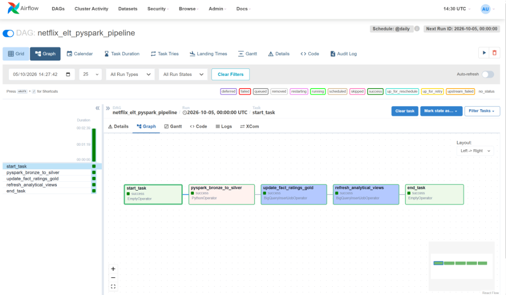
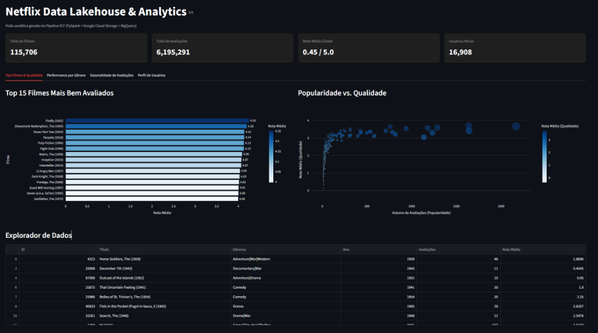
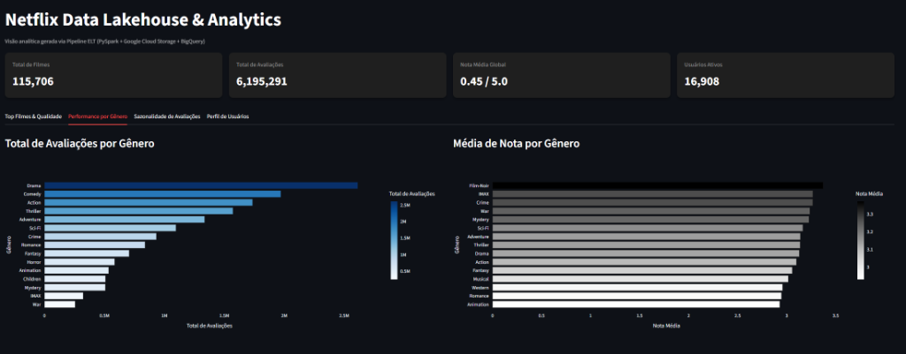
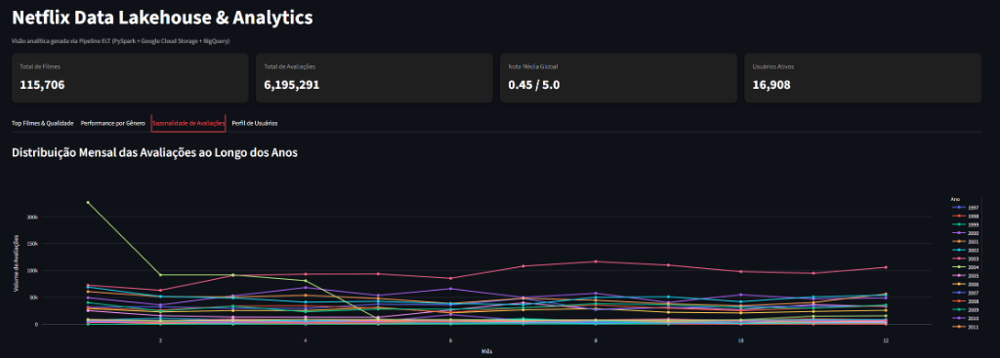
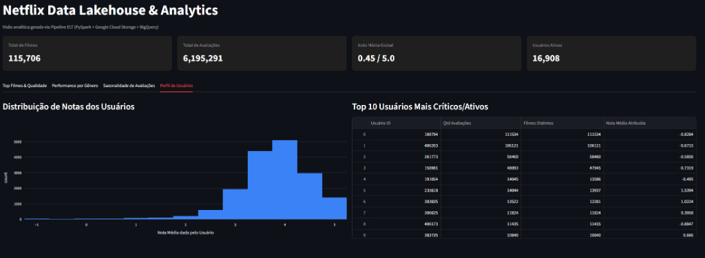

# End-to-End Data Pipeline com GCS, PySpark e Streamlit

> Pipeline ELT containerizado para transformar dados de filmes e avaliações em Parquet no Google Cloud Storage, disponibilizar uma camada analítica no BigQuery e explorar os resultados em um dashboard Streamlit.

## 📌 Visão Geral

Este projeto organiza um fluxo analítico para um catálogo de filmes e seu histórico de avaliações de usuários. Os arquivos de entrada são CSVs com metadados de filmes, avaliações históricas e avaliações adicionais de usuários, em uma estrutura compatível com datasets públicos do ecossistema MovieLens.

O objetivo é responder perguntas como:

- Quais filmes combinam maior nota média e maior volume de avaliações?
- Quais gêneros concentram mais avaliações e melhor desempenho médio?
- Como o volume de avaliações varia ao longo dos meses e anos?
- Qual é o perfil de atividade e de notas dos usuários?

O pipeline resolve problemas comuns de uma rotina analítica:

- padronização de tipos e nomes de colunas;
- extração do ano de lançamento a partir do título;
- união de fontes de avaliações com o mesmo contrato de dados;
- tratamento de valores `NA`, timestamps inválidos e chaves nulas;
- separação entre armazenamento bruto, dados tratados e consumo analítico;
- desacoplamento entre processamento, armazenamento e visualização.

## 🏗️ Arquitetura & Fluxo de Dados


### Estágios do fluxo

1. **Orquestração:** o Apache Airflow agenda a DAG `netflix_elt_pyspark_pipeline` diariamente, sem `catchup`. O executor configurado é o `LocalExecutor`, com metadados armazenados em PostgreSQL.
2. **Bronze:** o bucket GCS deve conter os CSVs brutos em `bronze/`. O código espera `movies.csv`, `user_rating_history.csv` e `ratings_for_additional_users.csv`.
3. **Bronze → Silver:** o PySpark lê os CSVs via conector Hadoop-GCS, normaliza IDs, converte notas e timestamps, extrai `release_year` e remove registros inválidos.
4. **Silver:** os dados tratados são gravados no GCS em Parquet, em `silver/movies/` e `silver/ratings/`. O modo `overwrite` torna cada execução uma reconstrução completa dessas saídas.
5. **Gold/serving:** o BigQuery expõe o Parquet de ratings por uma external table e materializa `fact_ratings`. A DAG também atualiza a view `vw_top_movies`; as demais views analíticas consumidas pelo dashboard precisam existir no dataset configurado.
6. **Consumo:** o Streamlit consulta as views do BigQuery com cache de dados por cinco minutos e oferece filtros, KPIs, gráficos Plotly e tabelas exploráveis.

O **Google Cloud Storage** funciona como Data Lake/Object Storage: mantém os arquivos brutos e tratados em um serviço escalável, enquanto o Spark executa as transformações e o BigQuery atende às consultas analíticas. Essa separação permite alterar o mecanismo de processamento sem acoplar o armazenamento ao dashboard.

### Camadas de dados

| Camada | Localização | Conteúdo | Formato |
| --- | --- | --- | --- |
| Bronze | `gs://<bucket>/bronze/` | CSVs originais de filmes e avaliações | CSV |
| Silver | `gs://<bucket>/silver/movies/` | Filmes com IDs e ano normalizados | Parquet |
| Silver | `gs://<bucket>/silver/ratings/` | Ratings válidos, unidos e tipados | Parquet |
| Gold | BigQuery, dataset `GCP_DATASET_GOLD` | `fact_ratings`, dimensões e views analíticas | Tabelas/views BigQuery |

O código não implementa Delta Lake nem particionamento explícito por coluna. A otimização observada é o uso do formato colunar Parquet; o diretório de ratings é lido pelo BigQuery com o padrão `silver/ratings/*.parquet`.

## 🛠️ Stack Tecnológica & Decisões Técnicas

- **Apache Airflow 2.8.2:** agenda e encadeia as etapas do ELT com dependências explícitas.
- **PySpark 3.5+:** executa a limpeza e transformação com uma API adequada para evolução a volumes maiores, usando `local[*]` no ambiente atual.
- **Google Cloud Storage:** oferece armazenamento de objetos desacoplado do compute e suporta o acesso `gs://` pelo conector Hadoop-GCS.
- **BigQuery:** fornece external tables, materialização de tabelas Gold e views SQL para consumo analítico.
- **Pandas + Plotly:** convertem resultados das consultas em tabelas e visualizações interativas no dashboard.
- **Streamlit:** entrega rapidamente uma interface analítica diretamente conectada às views do BigQuery.
- **Docker Compose:** reproduz o ambiente com Airflow, PostgreSQL, PySpark e dashboard em serviços separados.
- **Parquet + PyArrow:** reduzem o custo de leitura analítica em relação a CSV e preservam um formato colunar interoperável.

## 📂 Estrutura do Repositório

```text
netflix-pipeline/
├── app.py                         # Dashboard Streamlit e consultas às views Gold
├── dags/
│   └── netflix_pipeline_dag.py    # DAG diária e jobs BigQuery
├── docs/
│   └── images/                    # Evidências de execução da DAG e capturas do dashboard
├── scripts/
│   └── spark_bronze_to_silver.py  # Limpeza e escrita das saídas Parquet
├── Dockerfile                     # Airflow + Java 17 + PySpark + conector GCS
├── Dockerfile.dashboard           # Imagem independente do Streamlit
├── docker-compose.yml             # Airflow, scheduler, PostgreSQL e dashboard
├── requirements.txt               # Provedores GCP, BigQuery, Spark e suporte Parquet
├── .env.example                   # Template de configuração local
└── .gitignore                     # Exclusão de credenciais, ambiente e logs
```

## 📊 Visualização & Insights

O dashboard apresenta quatro áreas analíticas:

- **Top Filmes & Qualidade:** ranking de filmes, relação entre popularidade e nota e tabela filtrável;
- **Performance por Gênero:** volume total de avaliações e nota média por gênero;
- **Sazonalidade de Avaliações:** série temporal mensal por ano;
- **Perfil de Usuários:** distribuição de notas e usuários com maior atividade.

Os filtros permitem restringir por gênero, intervalo de ano de lançamento e quantidade mínima de avaliações. A aplicação calcula KPIs de filmes, avaliações, nota média global e usuários ativos a partir dos dados carregados do BigQuery.

## 📊 Evidências de Execução & Dashboard Analítico

Esta seção documenta a execução real do pipeline ponta a ponta e a validação das camadas de dados através da orquestração no Apache Airflow e da exploração analítica no Streamlit.

### ⚙️ 1. Orquestração e Processamento Ponta a Ponta (Apache Airflow)

A DAG `netflix_elt_pyspark_pipeline` gerencia o fluxo de ponta a ponta, processando **mais de 6.1 milhões de registros** entre Google Cloud Storage, Apache Spark e Google BigQuery. Todas as tarefas foram concluídas com sucesso (`success`), garantindo a integridade dos dados e o cumprimento das dependências:

- **`start_task`** (`EmptyOperator`): Início e gatilho do fluxo diário.
- **`pyspark_bronze_to_silver`** (`PythonOperator`): Extração dos CSVs brutos do bucket GCS (`bronze/`), limpeza, tipagem de dados, enriquecimento com `release_year` e gravação colunar otimizada em Parquet (`silver/`).
- **`update_fact_ratings_gold`** (`BigQueryInsertJobOperator`): Criação/atualização da tabela de fatos `fact_ratings` no BigQuery a partir dos arquivos Parquet da camada Silver.
- **`refresh_analytical_views`** (`BigQueryInsertJobOperator`): Materialização e atualização das views analíticas que servem à camada de consumo.
- **`end_task`** (`EmptyOperator`): Conclusão do pipeline com validação completa do fluxo.

<p align="center">
  
</p>

---

### 📈 2. Camada Analítica e Visualização Interativa (Streamlit + Plotly)

O dashboard interativo conecta-se diretamente às views da camada Gold no BigQuery com cache configurado (TTL de 5 minutos), permitindo filtragem dinâmica por gênero, ano de lançamento e volume de avaliações.

#### KPIs Globais Consolidados

| Total de Filmes | Total de Avaliações | Usuários Ativos |
| :---: | :---: | :---: |
| **115,706** | **6,195,291** | **16,908** |

---

#### 🖼️ Visões Analíticas Detalhadas

<details open>
<summary><b>🎬 Aba 1: Top Filmes & Qualidade</b></summary>
<br>

> **Insight:** Avaliação ponderada por volume de engajamento e exploração tabular. Permite identificar clássicos e produções mais bem avaliadas (como *Firefly*, *The Shawshank Redemption*, *Dune: Part Two*, *Parasite* e *Pulp Fiction* no topo) e avaliar a relação entre popularidade e qualidade, além de contar com explorador tabular de dados com busca e ordenação.

<p align="center">
  
</p>
</details>

<details>
<summary><b>🎭 Aba 2: Performance por Gênero</b></summary>
<br>

> **Insight:** Volume de engajamento vs. nota média por categoria. Gêneros com grande apelo de público como **Drama** (liderando com quase 2.5 milhões de avaliações), **Comedy** e **Action** dominam o volume absoluto, enquanto categorias como **Film-Noir**, **IMAX** e **Crime** registram as maiores médias de avaliação da plataforma.

<p align="center">
  
</p>
</details>

<details>
<summary><b>📅 Aba 3: Sazonalidade de Avaliações</b></summary>
<br>

> **Insight:** Séries temporais de engajamento mensal ao longo dos anos. Exibe a distribuição mês a mês das avaliações para múltiplos anos históricos, evidenciando padrões de consumo sazonais e o comportamento da base ao longo do tempo.

<p align="center">
  
</p>
</details>

<details>
<summary><b>👤 Aba 4: Perfil de Usuários</b></summary>
<br>

> **Insight:** Comportamento e distribuição da pontuação da base. O histograma revela maior densidade de avaliações concentrada na faixa de 3.5 a 4.5 estrelas, enquanto a tabela dos 10 usuários mais críticos e ativos mapeia os perfis de maior impacto volumétrico (com o principal usuário superando 111 mil filmes avaliados).

<p align="center">
  
</p>
</details>

---

**Status:** Pipeline ELT validado e em produção local/containerizada, processando com sucesso mais de 6.1 milhões de registros entre GCS, PySpark e BigQuery, com orquestração resiliente via Airflow e visualização analítica em Streamlit.

## 🚀 Como Executar Localmente

### 1. Pré-requisitos

- Docker Desktop com Docker Compose;
- um projeto GCP com APIs do Cloud Storage e BigQuery habilitadas;
- um bucket GCS e um dataset BigQuery;
- uma Service Account com permissões para ler/escrever no bucket e consultar/criar objetos no BigQuery;
- o JSON da Service Account salvo localmente como `config/google_credentials.json`.

O diretório `config/` é ignorado pelo Git. Nunca versionar o JSON de credenciais.

### 2. Configurar o ambiente

Na raiz do projeto:

```bash
cp .env.example .env
mkdir -p config
```

No Windows PowerShell, o equivalente é:

```powershell
Copy-Item .env.example .env
New-Item -ItemType Directory -Force config
```

Edite `.env` e informe pelo menos:

```dotenv
GCP_PROJECT_ID=seu-projeto-gcp-id
GCP_DATASET_GOLD=netflix_analitical
GCP_BUCKET_NAME=seu-bucket-gcp
GCP_CREDENTIALS_FILE=google_credentials.json
```

O `GCP_BUCKET_NAME` pode ser informado como `meu-bucket` ou `gs://meu-bucket`; o código normaliza os dois formatos.

### 3. Preparar o Bronze no GCS

Envie os arquivos para o layout esperado:

```text
gs://seu-bucket-gcp/bronze/movies.csv
gs://seu-bucket-gcp/bronze/user_rating_history.csv
gs://seu-bucket-gcp/bronze/ratings_for_additional_users.csv
```

Os contratos usados pelo Spark incluem `movieId`, `title`, `genres` em filmes e `userId`, `movieId`, `rating`, `tstamp` em avaliações.

### 4. Subir os serviços

```bash
docker compose up -d --build
```

Acompanhe a inicialização com:

```bash
docker compose logs -f airflow-webserver
docker compose ps
```

Interfaces disponíveis:

- Airflow: [http://localhost:8080](http://localhost:8080)
- Streamlit: [http://localhost:8501](http://localhost:8501)

As credenciais padrão do Airflow vêm do `.env.example` (`admin`/`admin`) e devem ser alteradas em qualquer ambiente compartilhado.

### 5. Executar o pipeline

Na interface do Airflow, habilite e dispare a DAG `netflix_elt_pyspark_pipeline`. Também é possível dispará-la pelo container:

```bash
docker compose exec airflow-scheduler airflow dags trigger netflix_elt_pyspark_pipeline
```

A sequência executada é:

```text
start_task
  → pyspark_bronze_to_silver
  → update_fact_ratings_gold
  → refresh_analytical_views
  → end_task
```

### 6. Executar somente o dashboard

O serviço `dashboard` já é iniciado pelo Compose. Para execução fora do Docker, instale as dependências específicas da aplicação e rode:

```bash
pip install streamlit plotly google-cloud-bigquery pandas pyarrow db-dtypes
streamlit run app.py
```

O dashboard espera as views abaixo no dataset configurado:

`vw_top_movies`, `vw_movies_kpis`, `vw_genre_performance`, `vw_ratings_heatmap` e `vw_user_summary`.

Essa é uma pré-condição importante da implementação atual: a DAG cria explicitamente `fact_ratings` e `vw_top_movies`, mas não contém as definições completas de todas essas views nem executa a task de filmes definida no código SQL. Em uma implantação limpa, essas tabelas/views devem ser provisionadas antes de abrir o Streamlit.
